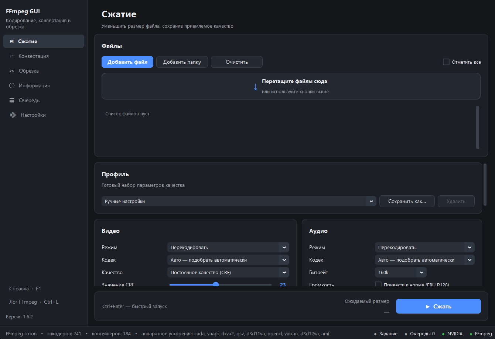

# FFmpeg GUI

Программа для тех, кому нужно сжать, перекодировать или обрезать видео, но не
хочется каждый раз вспоминать ключи FFmpeg.

Списков кодеков и контейнеров в коде нет: программа при запуске спрашивает у
установленного FFmpeg, что он умеет, и показывает ровно это. На машине с
NVIDIA в списке будет NVENC, на машине без неё — не будет, и вы не узнаете об
этом уже после того, как задание упало.



---

## Что она делает

**Сжимает.** Можно двигать ползунок качества, а можно просто сказать «уложись в
25 МиБ» — битрейт посчитается сам, с поправкой на то, сколько заберёт звук.
Ожидаемый размер результата виден рядом с кнопкой запуска и пересчитывается на
лету, так что подбирать параметры вслепую не нужно.

**Объясняет, что значат числа.** Под ползунком CRF написано словами: «отличное —
от оригинала не отличить», «среднее — артефакты заметны на движении»,
«шакальность». В подсказке к каждому параметру сказано не только что он делает,
но и что от этого будет с файлом — насколько он вырастет и что заметит глаз.

**Конвертирует.** Если перекодирование не требуется, предложит просто сменить
контейнер — это мгновенно и без потерь. Отдельными предустановками — вытащить
звук в MP3 и сделать GIF (палитра считается по самому ролику, а не берётся
стандартная, поэтому анимация не рябит).

**Режет и склеивает.** Обрезка по таймкоду — быстрая копированием или точная по
кадру. Несколько файлов можно склеить в один; если они сняты одним устройством,
склейка пройдёт без перекодирования за секунды.

**Обрабатывает картинку.** Поворот, кадрирование, деинтерлейс, шумоподавление,
водяной знак с выбором угла и прозрачности.

**Не бросает на полпути.** Если видеокарта не отозвалась — старый драйвер,
отключённая дискретная графика, — задание не падает с сообщением про NVENC, а
само повторяется на процессоре. Результат сначала пишется во временный файл,
проверяется, и только потом занимает своё место: неудачное кодирование не
испортит то, что уже лежало на диске.

**Работает пачками.** Очередь с параллельным выполнением, прогресс по каждому
заданию, повтор упавших. Папка наблюдения: положили файл — он сам ушёл в
очередь. Имя результата собирается по шаблону вроде `{имя}_{высота}p_{кодек}`,
чтобы через месяц было понятно, что это за файл.

---

## Установка

Скачайте `FFmpegGUI.exe` со страницы выпусков — это один самодостаточный файл,
он запускается из любой папки и ничего не устанавливает в систему.

Из исходников:

```bash
git clone https://github.com/Kap1tanRex/ffmpeg-gui
cd ffmpeg-gui
python -m venv .venv
.venv\Scripts\activate          # на Linux и macOS: source .venv/bin/activate
pip install -r requirements.txt
python main.py
```

Нужен Python 3.12 или новее. На Linux дополнительно — системный Tk
(`sudo apt install python3-tk`).

### FFmpeg

FFmpeg в поставку не входит. Программа ищет его в таком порядке:

1. путь, указанный вами в настройках;
2. папка рядом с программой и подпапка `ffmpeg/bin`;
3. переменная окружения `PATH`;
4. привычные места вроде `C:\ffmpeg\bin`, `/usr/bin`, `/opt/homebrew/bin`.

Если не нашла — предложит указать путь или скачать сборку прямо из настроек, с
gyan.dev или BtbN/FFmpeg-Builds на выбор. Архив проверяется по контрольной
сумме, и старая папка заменяется только после того, как новый `ffmpeg.exe`
успешно запустился, — неудачная загрузка не оставит вас без рабочего FFmpeg.

Нужна версия 5.0 или новее; разрабатывалось и проверялось на 9.0.

---

## Горячие клавиши

| Клавиши | Действие |
|---|---|
| `Ctrl+O` | добавить файл |
| `Ctrl+Shift+O` | добавить папку |
| `Delete` | убрать файл из списка |
| `Ctrl+Enter` | запустить операцию текущего раздела |
| `Esc` | отменить выполняющееся задание |
| `Ctrl+S` | сохранить проект |
| `Ctrl+L` | открыть лог FFmpeg |
| `F1` | справка |

Командная строка:

```bash
python main.py video1.mkv video2.mp4   # открыть с файлами
python main.py --diagnostics           # отчёт о среде, без интерфейса
python main.py --config-dir ./config   # переносимый режим: настройки рядом
```

Пункт «Открыть в FFmpeg GUI» в контекстном меню проводника добавляется кнопкой
в настройках. Запись идёт только в ветку текущего пользователя, права
администратора не нужны, убирается той же кнопкой.

---

## Настройки и внешний вид

Тема — светлая, тёмная или следом за системой. Масштаб интерфейса от 100 % до
175 %, если у вас большой монитор или экран с высокой плотностью пикселей;
применяется он при следующем запуске.

Цвета, скругления и шрифты заданы токенами в `gui/theming/themes/*.json` — в
коде виджетов нет ни одного цвета «на глаз». Свои палитры можно положить в
папку настроек, они наложатся поверх встроенных.

Где что лежит:

| ОС | Настройки |
|---|---|
| Windows | `%APPDATA%\FFmpegGUI` |
| Linux | `~/.config/FFmpegGUI` |
| macOS | `~/Library/Application Support/FFmpegGUI` |

Там же `capabilities.json` — кэш возможностей FFmpeg, привязанный к его версии
и пути. Опрос занимает время, поэтому делается один раз и пересобирается при
смене сборки (или кнопкой в настройках). Временные файлы — в
`%TEMP%/FFmpegGUI`, чистятся при выходе.

---

## Как это устроено

```
GUI → Application → Job → Validator → CommandBuilder → FFmpeg → результат
                     ↑                                     ↓
              Capabilities ← FFmpegService          ProcessManager
```

Файл разбирается `ffprobe`, настройки раздела превращаются в задание, оно
проверяется до запуска (есть ли энкодер, влезет ли на диск, не пуст ли диапазон
обрезки), и только потом собирается команда. Команду можно посмотреть и
скопировать до запуска — кнопка «Показать команду FFmpeg».

Команда всегда собирается **списком аргументов** и запускается с
`shell=False` — строка для оболочки не строится никогда, поэтому имя файла с
кавычками или точкой с запятой ничего не сломает. Пути внутри фильтров
экранируются. Существующий файл не перезаписывается без вашего согласия.

В сеть программа ходит только за обновлениями — своими и FFmpeg. Политика
запроса одна на оба случая (`services/http.py`): только `https`, только к
GitHub и gyan.dev, перенаправления обрабатываются вручную и не больше трёх,
проверка сертификата не отключается, размер ответа ограничен. Пока репозиторий
обновлений не задан в настройках, программа в сеть не ходит вовсе.

### Структура

| Каталог | Что внутри |
|---|---|
| `app/` | контроллер, настройки, шина событий |
| `core/` | модели, разбор возможностей FFmpeg, сборка команды, проверки, тексты подсказок |
| `services/` | запуск процессов, очередь, файловая система, сеть, наблюдение за папкой |
| `gui/` | окно, разделы, виджеты, оформление |
| `resources/` | переводы и значки |

---

## Сборка

```bash
pip install pyinstaller
pyinstaller --noconfirm FFmpegGUI.spec
```

Готовый `dist/FFmpegGUI.exe` — один файл, запускается из любой папки. FFmpeg в
него не включается.

---

## Чего пока нет

- Автоматических тестов в репозитории нет: изменения проверялись сценариями на
  живом окне и настоящим кодированием, но в коммиты они не попали.
- Масштаб интерфейса меняется только при перезапуске — перестроить уже собранное
  окно CustomTkinter не умеет, раскладка распадается.
- Двухпроходная нормализация громкости не сделана: сейчас `loudnorm` работает в
  один проход, чего достаточно для большинства записей, но на материале с
  сильными перепадами громкости двухпроходный вариант звучал бы ровнее.

---

## Лицензия

[GNU General Public License v3.0](LICENSE). Производные работы обязаны
оставаться открытыми под той же лицензией.

CustomTkinter, tkinterdnd2 и Pillow распространяются под разрешительными
лицензиями (MIT и MIT-CMU) и с GPL-3.0 совместимы. Сам FFmpeg в поставку не
входит и частью этой программы не является — она лишь запускает установленный
в системе исполняемый файл.
